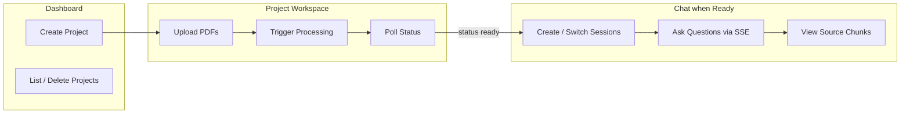
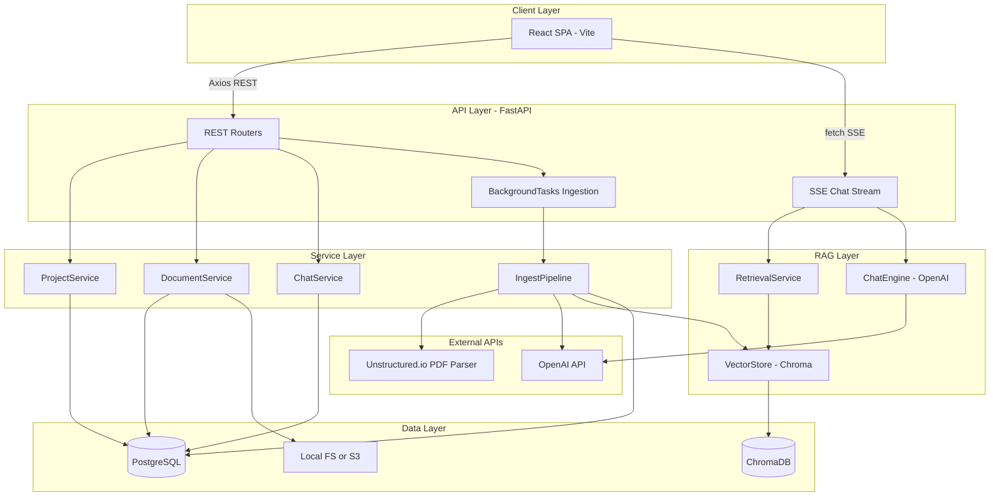
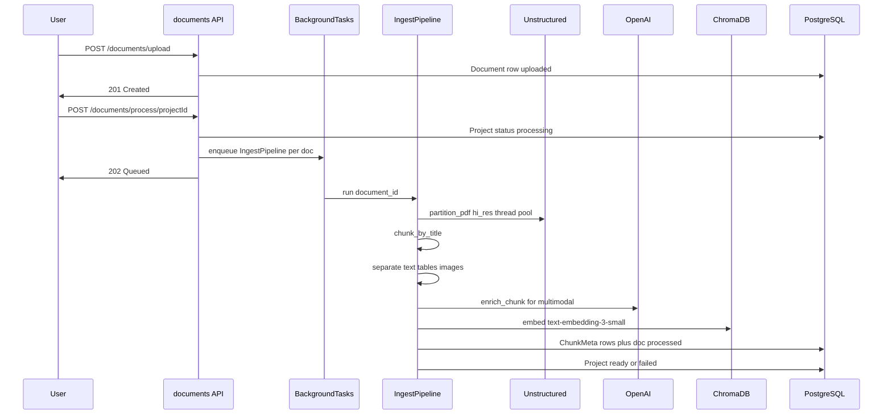
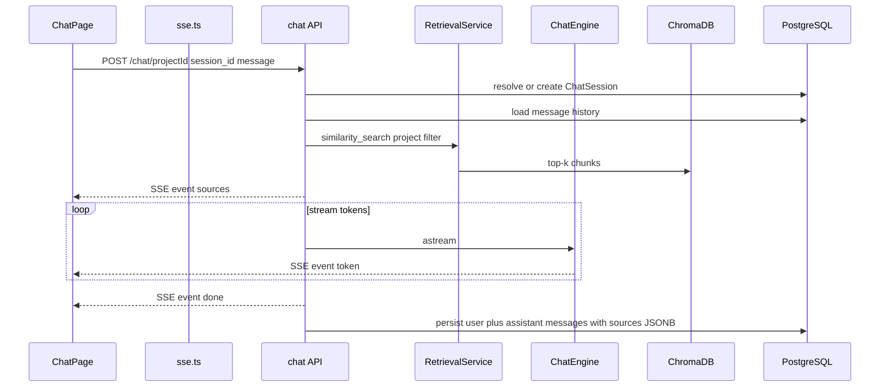
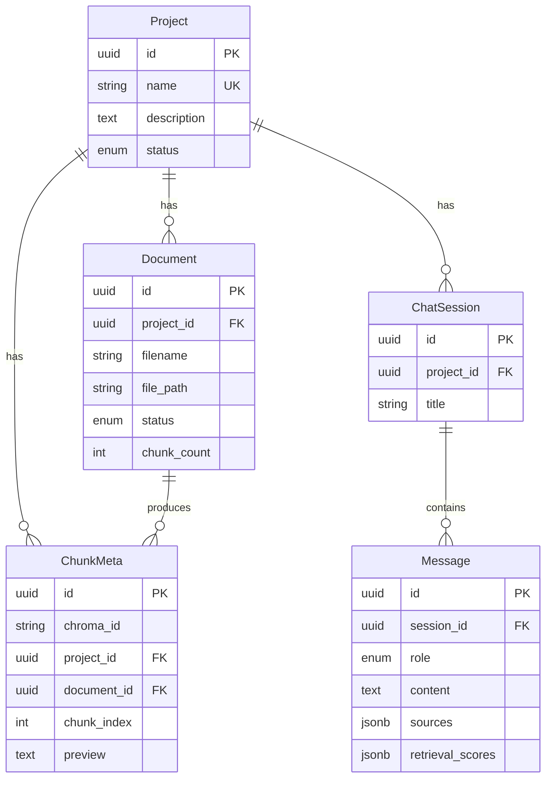
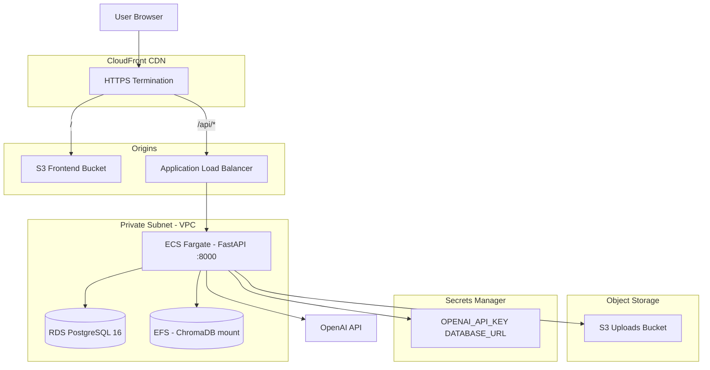

# PagePilot — Application Analysis Report

## Executive Summary

**PagePilot** is a full-stack **AI Document Intelligence** system. Users organize work into **projects**, upload **PDFs**, trigger a **multimodal ingestion pipeline** (parse → chunk → separate text/tables/images → GPT enrichment → embed), then **chat** over the ingested content with **SSE-streamed** answers and **source citations**.

| Attribute | Value |
|-----------|-------|
| Type | Full-stack web app (React SPA + FastAPI REST/SSE API) |
| Primary use case | Enterprise-style document Q&A over PDF corpora |
| AI stack | OpenAI (`gpt-4o`, `text-embedding-3-small`), LangChain, ChromaDB |
| Persistence | PostgreSQL (metadata + chat), ChromaDB (vectors), local/S3 (PDFs) |
| Production | AWS `ap-south-1` via Terraform (ECS, RDS, S3, EFS, CloudFront) |
| Auth | **None** — all API routes are public |

---

## 1. Problem Domain and User Journey

> **About the diagrams in this doc:** Blocks marked ` ```mermaid ` are **diagram code**, not regular code. They draw flowcharts when viewed on **GitHub**, **GitLab**, or editors with Mermaid support. In a plain text editor you will only see the text below — use the **text walkthrough** under each diagram if it does not render.

### User journey (text walkthrough)

PagePilot follows one main path from start to finish:

1. **Dashboard** — Create a project, see your list, delete projects if needed.
2. **Project workspace** — Open a project, upload PDF files, click **Process** to run ingestion, wait while status shows `processing` (the app polls automatically).
3. **Chat** — When status becomes `ready`, you can start chat sessions, ask questions (answers stream in live), and open **source chunks** to see which parts of the PDFs were used.

```
  [Dashboard]          [Project workspace]              [Chat]
  Create project  -->  Upload PDFs  -->  Process  -->  Ask questions
  List / delete        Poll until ready                  View sources
```

### User journey (diagram)

If your viewer supports Mermaid, this draws the same flow left-to-right:



**User-facing pages** ([`frontend/src/App.tsx`](../frontend/src/App.tsx)):

- `/` — [`DashboardPage.tsx`](../frontend/src/pages/DashboardPage.tsx): project CRUD, status badges, polling while `processing`
- `/project/:projectId` — [`ChatPage.tsx`](../frontend/src/pages/ChatPage.tsx): upload sidebar, process button, three-column chat UI (sessions | messages | sources)

**Project lifecycle states** ([`backend/app/models/project.py`](../backend/app/models/project.py)): `created` → `processing` → `ready` | `failed`

---

## 2. High-Level System Architecture



**Entry points:**

- Backend: [`backend/app/main.py`](../backend/app/main.py) — `create_app()`, lifespan runs `init_db()` and creates upload/Chroma dirs
- Frontend: [`frontend/src/main.tsx`](../frontend/src/main.tsx) → [`App.tsx`](../frontend/src/App.tsx)

**Layered backend layout** (router → service → ORM/RAG, no separate controller tier):

| Directory | Responsibility |
|-----------|----------------|
| [`backend/app/api/`](../backend/app/api/) | HTTP: projects, documents, chat (SSE), health |
| [`backend/app/services/`](../backend/app/services/) | Business logic |
| [`backend/app/ingestion/`](../backend/app/ingestion/) | PDF pipeline |
| [`backend/app/rag/`](../backend/app/rag/) | Vector store, retrieval, LLM streaming |
| [`backend/app/models/`](../backend/app/models/) | SQLAlchemy ORM |
| [`backend/app/schemas/`](../backend/app/schemas/) | Pydantic DTOs |
| [`backend/app/utils/storage.py`](../backend/app/utils/storage.py) | Local vs S3 PDF storage |

---

## 3. Ingestion Pipeline (Core Differentiator)

Multimodal RAG: tables and images in PDFs are parsed, enriched with GPT-4o, then embedded alongside text.



**Pipeline modules** ([`backend/app/ingestion/pipeline.py`](../backend/app/ingestion/pipeline.py)):

1. **Parse** — `parser.py`: Unstructured `partition_pdf` (hi-res, table structure, image payloads)
2. **Chunk** — `chunker.py`: `chunk_by_title` (~3000 char max)
3. **Separate** — `content_separator.py`: split text / table HTML / base64 images per chunk
4. **Enrich** — `enrichment.py`: GPT-4o summary for non-text chunks
5. **Embed** — `rag/vector_store.py`: Chroma + `text-embedding-3-small` with `project_id`, `document_id` metadata
6. **Persist** — `ChunkMeta` in PostgreSQL for observability/debugging

CPU-heavy parsing runs in a **thread pool**; enrichment/embedding use `asyncio.to_thread`.

---

## 4. RAG Chat Flow



**SSE event types** ([`frontend/src/lib/sse.ts`](../frontend/src/lib/sse.ts)): `sources` → `token` (×N) → `done` | `error`

**ChatEngine** ([`backend/app/rag/chat_engine.py`](../backend/app/rag/chat_engine.py)): system prompt + up to ~12k chars retrieved context + last 10 history turns → `ChatOpenAI` stream

**State split on frontend:**

- **React Query** — server-fetched projects, documents, sessions, messages
- **Zustand** (`chat-store.ts`) — live streaming tokens, sources panel, session UX (avoids refetch overwriting stream)

---

## 5. Data Model



**Dual storage pattern:**

| Store | Contents |
|-------|----------|
| **PostgreSQL** | Projects, documents, chunk metadata previews, chat sessions/messages |
| **ChromaDB** | Embeddings + full enriched chunk text (`original_content` JSON) |
| **Filesystem / S3** | Raw PDF binaries |

On project delete: cascade PG rows, delete Chroma collection filter, remove upload directory ([`project_service.py`](../backend/app/services/project_service.py)).

---

## 6. API Surface

Base: `/api/v1` (local default: `http://localhost:8000/api/v1`)

| Method | Path | Purpose |
|--------|------|---------|
| POST | `/projects` | Create project |
| GET | `/projects` | List all |
| GET | `/projects/{id}` | Get one |
| DELETE | `/projects/{id}` | Delete project + data |
| POST | `/documents/upload` | Multipart PDF upload |
| GET | `/documents/{project_id}` | List documents |
| POST | `/documents/process/{project_id}` | Start background ingestion |
| POST | `/chat/{project_id}` | **SSE** chat stream |
| GET/POST | `/chat/{project_id}/sessions` | Session CRUD |
| GET | `/chat/{project_id}/sessions/{id}/messages` | Message history |
| GET | `/health` | Liveness |

**No authentication** — only UUID validation and session↔project ownership checks.

---

## 7. Frontend Architecture

| Concern | Technology |
|---------|------------|
| UI framework | React 19 + TypeScript |
| Build | Vite 6 |
| Styling | Tailwind CSS 4 (dark Tron theme) |
| Routing | React Router 7 |
| Server state | TanStack React Query 5 (polling during `processing`) |
| Client state | Zustand (chat stream, toasts) |
| HTTP | Axios ([`lib/api.ts`](../frontend/src/lib/api.ts)) |
| Streaming | Custom fetch SSE ([`lib/sse.ts`](../frontend/src/lib/sse.ts)) |

**Key components:** `ChatWindow`, `MessageBubble`, `SourceViewer`, `UploadDialog`, `CreateProjectModal`, `ToastHost`

**Config:** `VITE_API_URL` defaults to `http://localhost:8000/api/v1`

---

## 8. Deployment Architecture (AWS Production)



**Terraform** ([`infra/`](../infra/)): ~48 resources — VPC, NAT, ECS Fargate, RDS `db.t3.micro`, dual S3 buckets, EFS for Chroma persistence, ALB, CloudFront dual-origin, Secrets Manager, CloudWatch logs.

**Runtime env differences:**

| Setting | Local | AWS ECS |
|---------|-------|---------|
| `STORAGE_BACKEND` | `local` | `s3` |
| `CHROMA_PERSIST_DIR` | `./data/chroma_db` | `/mnt/chroma` (EFS) |
| CORS | `localhost:5173` | `*` |

**Live URLs** (from [`infra/README.md`](../infra/README.md)):

- Frontend: `https://daqpw6pocqhjr.cloudfront.net`
- API: `https://daqpw6pocqhjr.cloudfront.net/api/v1`

**Cost ops** ([`cloud-cmds.txt`](../cloud-cmds.txt)): scale ECS to 0 + stop RDS to save ~$100/mo when idle.

---

## 9. Tech Stack Summary

| Layer | Technologies |
|-------|--------------|
| Frontend | React 19, TypeScript, Vite 6, Tailwind 4, React Query, Zustand, Axios, React Router 7 |
| Backend | Python 3.11+, FastAPI, SQLAlchemy 2 async, Pydantic v2, Uvicorn |
| AI/RAG | LangChain, LangChain-OpenAI, ChromaDB, sse-starlette |
| Ingestion | Unstructured.io, Poppler, Tesseract |
| DB | PostgreSQL (asyncpg), ChromaDB persistent |
| Cloud | Terraform, ECS Fargate, RDS, S3, EFS, ALB, CloudFront, Secrets Manager, boto3 |
| DevOps | Docker multi-stage (API + nginx frontend), ECR push, `scripts/setup.sh` |

---

## 10. Strengths and Limitations

**Strengths:**

- End-to-end multimodal PDF RAG (text + tables + images)
- Production AWS topology with persistent Chroma on EFS
- Transparent retrieval: sources streamed to UI with scores and chunk previews
- Clean separation: ingestion / RAG / services / API layers
- Storage abstraction (local vs S3) for dev/prod parity

**Limitations / gaps:**

- **No user authentication** — suitable only for trusted/private networks
- **BackgroundTasks** for ingestion — not durable; ECS task restart loses in-flight jobs (SQS placeholder in config, unused)
- **Alembic** in requirements but no migration folder — schema via `init_db()` `create_all` only
- **No rate limiting** or API keys
- `getChatHistory` API exists but frontend uses per-session messages instead
- Layout footer hardcodes "localhost:8000" regardless of `VITE_API_URL`

**Planned/future** (per README): Celery for ingestion, SQS queue (`SQS_QUEUE_URL` in config)

---

## 11. Repository Map

```
pagePilot/
├── README.md              # Product docs, API table, quick start
├── cloud-cmds.txt         # AWS stop/start cost-saving commands
├── docs/
│   └── APPLICATION_REPORT.md   # This document
├── backend/               # FastAPI service
│   ├── app/               # Application code (api, core, db, ingestion, rag, ...)
│   ├── requirements.txt
│   └── Dockerfile
├── frontend/              # React SPA
│   ├── src/pages/         # DashboardPage, ChatPage
│   ├── src/components/    # Chat, upload, layout UI
│   ├── src/stores/        # Zustand stores
│   └── Dockerfile + nginx.conf
├── infra/                 # Terraform AWS stack
└── scripts/               # setup.sh, start-backend.sh, start-frontend.sh
```
